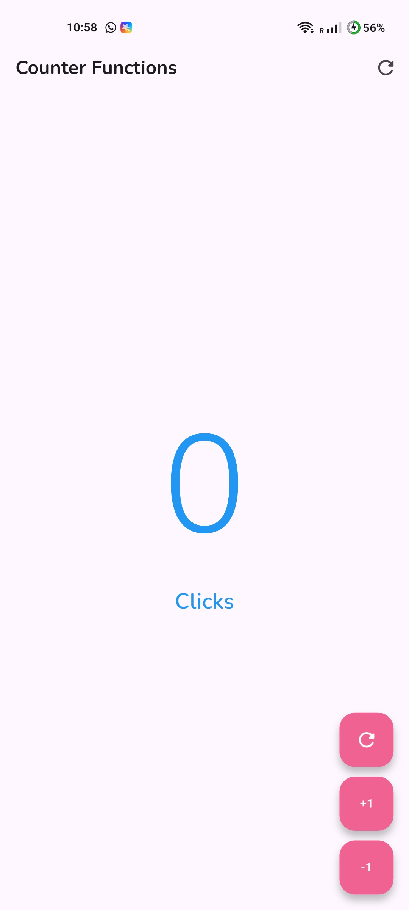
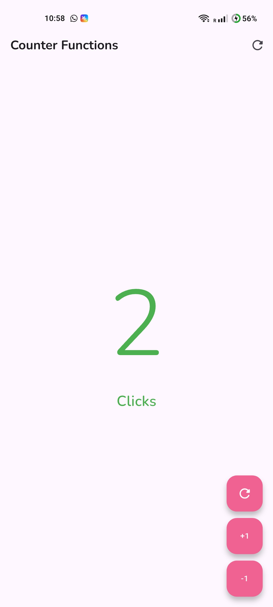
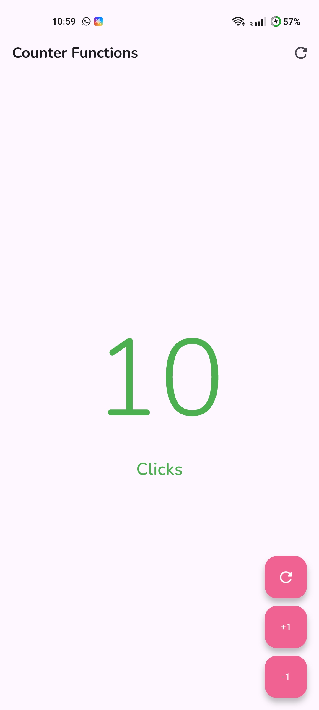
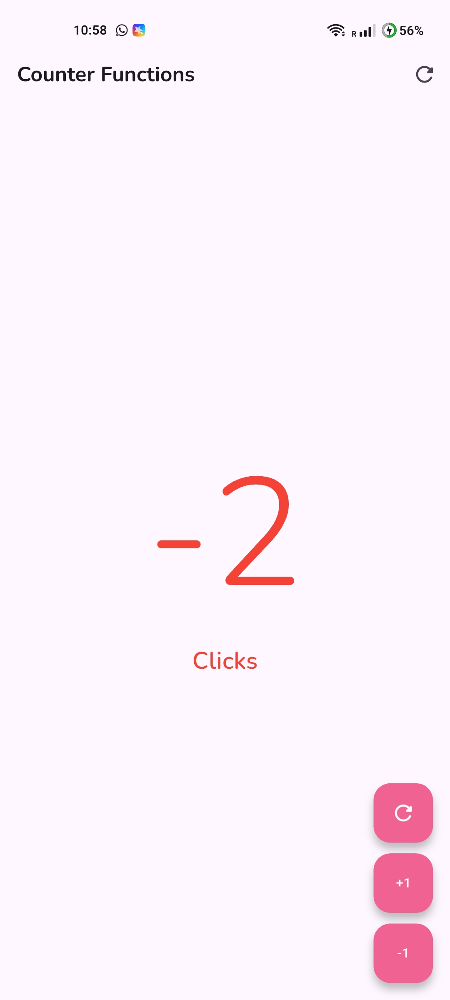
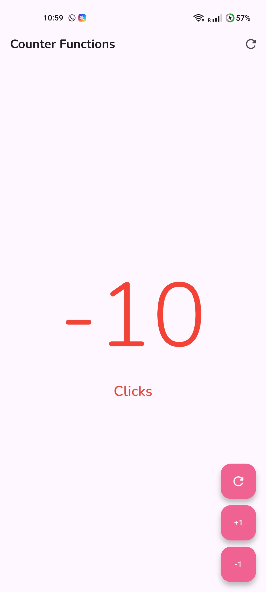
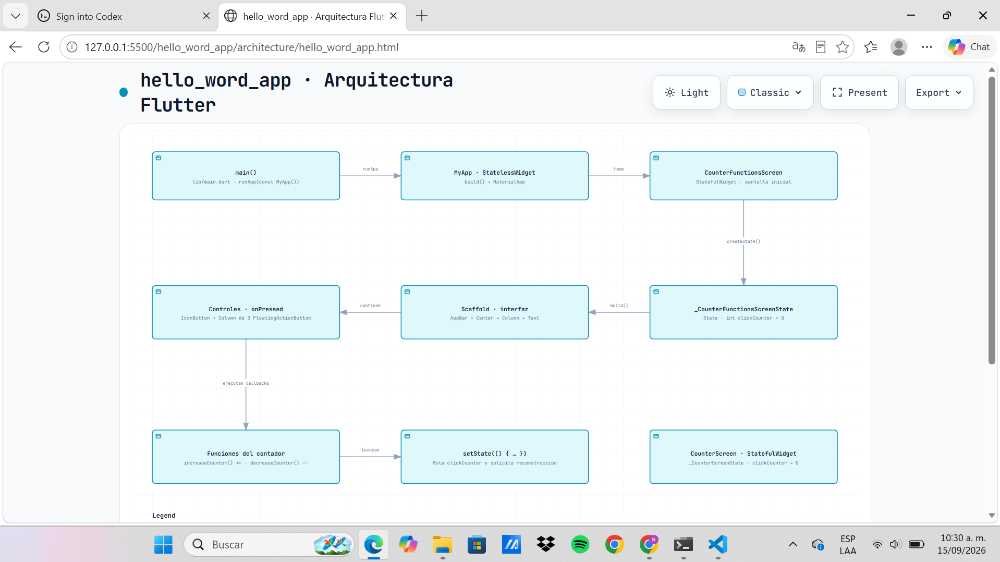
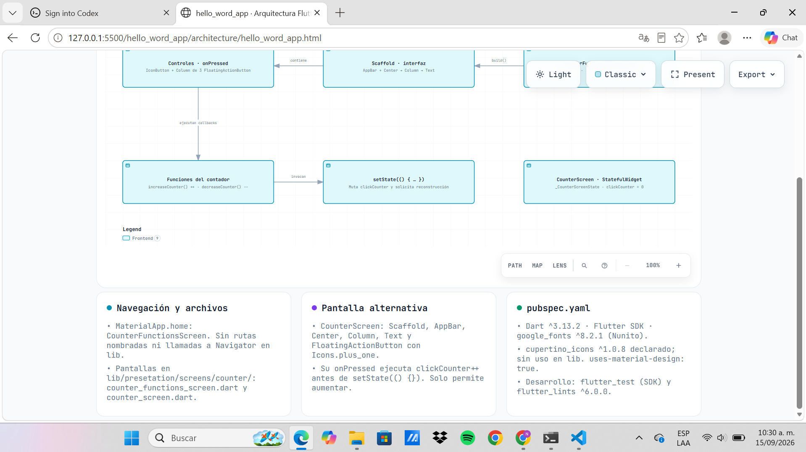

# Práctica 02: Mi Primera Aplicación Móvil con Flutter

## Descripción

Desarrollo de una aplicación móvil sencilla utilizando Flutter. La aplicación implementa un contador interactivo que permite aumentar, disminuir y restablecer su valor mediante botones flotantes.

## Actividades realizadas

- Creación de un proyecto móvil con Flutter.
- Implementación de una pantalla con un `StatefulWidget` para administrar el estado del contador.
- Incorporación de un botón para incrementar el contador en uno.
- Incorporación de un botón para disminuir el contador en uno.
- Incorporación de botones para restablecer el contador a cero.
- Aplicación de cambios visuales según el valor del contador: azul cuando es cero, verde cuando es positivo y rojo cuando es negativo.
- Ajuste del texto entre “Click” y “Clicks” dependiendo del valor mostrado.

## Objetivos

- Conocer la estructura básica de un proyecto Flutter.
- Comprender el uso de widgets con estado.
- Practicar la actualización de la interfaz mediante `setState`.
- Implementar la interacción mediante botones y eventos de usuario.
- Utilizar estilos condicionales para representar los diferentes estados de la aplicación.

## Funcionamiento del contador

| Valor | Color mostrado | Texto |
|:---:|:---:|:---:|
| `0` | Azul | Clicks |
| Mayor que `0` | Verde | Click o Clicks |
| Menor que `0` | Rojo | Clicks |

## Resultados y evidencias

## Contador en cero
El contador inicia en 0 entonces este debe de estar con un color azul

### Contador con valor positivo

Al presionar el botón de incremento, el contador aumenta su valor y la cantidad se muestra en color verde.

### Contador con valor negativo

Al presionar el botón de decremento hasta obtener un valor menor que cero, la cantidad se muestra en color rojo.

## Arquitectura de la aplicación

El siguiente diagrama representa la estructura y la relación entre los principales componentes de la aplicación Flutter.

### Enlace al diagrama interactivo

[Consultar la arquitectura de la aplicación](https://brisgregorio.github.io/Practicas_DMI_230362/hello_word_app/architecture/hello_word_app.html)
