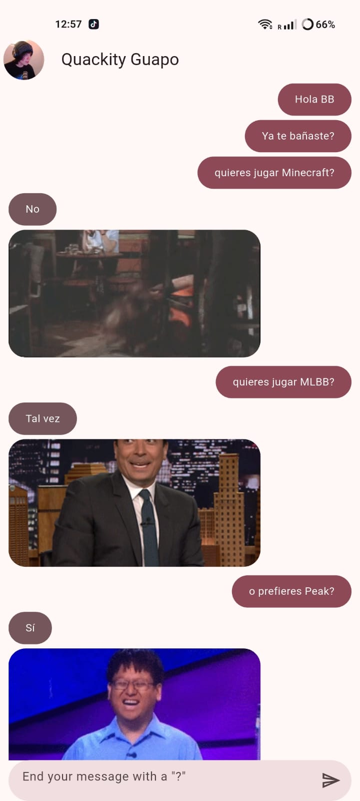
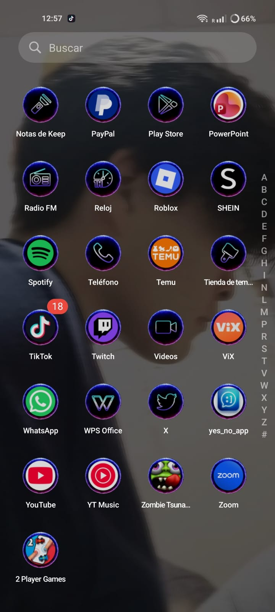

# Práctica 03: Yes No App

## Información general

| Dato | Información |
|---|---|
| Universidad | Universidad Tecnológica de Xicotepec de Juárez |
| Carrera | Ingeniería en Desarrollo y Gestión de Software |
| Materia | Desarrollo Móvil Integral |
| Docente | MTI Marco A. Ramírez Hernández |
| Práctica | Práctica 03 |
| Aplicación | Yes No App |
| Periodo | Septiembre – Diciembre 2026 |
| Desarrolladora | Brisa Nallely García Gregorio |

---

## Descripción

**Yes No App** es una aplicación móvil desarrollada con Flutter que simula una conversación mediante una interfaz de chat.

El usuario puede escribir una pregunta y enviarla desde la aplicación. Después, el sistema genera una respuesta aleatoria, que puede ser:

- Sí.
- No.
- Tal vez.

Cada respuesta se presenta mediante un mensaje acompañado de una imagen o GIF relacionado con la respuesta obtenida.

---

## Objetivo

Desarrollar una aplicación móvil en Flutter que permita aplicar conceptos como:

- Creación de interfaces de usuario.
- Uso de widgets personalizados.
- Gestión del estado de la aplicación.
- Consumo de una API mediante Dio.
- Uso del paquete Provider.
- Modelado de mensajes.
- Listas dinámicas.
- Campos de texto.
- Manejo de imágenes obtenidas desde Internet.
- Organización del proyecto mediante una arquitectura por capas.

---

## Tecnologías utilizadas

| Tecnología | Uso dentro del proyecto |
|---|---|
| Flutter | Desarrollo de la aplicación multiplataforma |
| Dart | Lenguaje de programación |
| Provider | Gestión del estado de la conversación |
| Dio | Realización de solicitudes HTTP |
| YesNo API | Generación de respuestas aleatorias |
| Material Design | Componentes visuales |
| Git | Control de versiones |
| GitHub | Almacenamiento del repositorio |
| Codex CLI | Apoyo para generar el diagrama de arquitectura |

---

### Explicación del flujo

1. El usuario escribe una pregunta en `MessageFieldBox`.
2. `ChatScreen` recibe la interacción del usuario.
3. `ChatProvider` administra los mensajes de la conversación.
4. `GetYesNoAnswer` realiza la petición mediante Dio.
5. La API devuelve la respuesta y la dirección de una imagen.
6. `YesNoModel` transforma la respuesta recibida.
7. La información se convierte en una entidad `Message`.
8. Los widgets muestran la pregunta y la respuesta en pantalla.

---

## Diagrama interactivo

El diagrama interactivo de la arquitectura se encuentra dentro de la carpeta `architecture`.

### Abrir el diagrama desde GitHub Pages

[Ver diagrama interactivo de Yes No App](https://brisgregorio.github.io/Practicas_DMI_230362/Practica_03/yes_no_app/architecture/yes_no_app.html)

### Consultar el archivo HTML en GitHub

[Ver código fuente del diagrama](https://github.com/Brisgregorio/Practicas_DMI_230362/blob/main/Practica_03/yes_no_app/architecture/yes_no_app.html)

---

## Evidencias

### Evidencia 1: ejecución de la aplicación

En la siguiente imagen se muestra la interfaz principal de **Yes No App** funcionando correctamente:

### Evidencia 2: funcionamiento de la conversación

En esta evidencia se observa la interacción del usuario con la aplicación y la respuesta acompañada de una imagen o GIF:

---

## Repositorio

El código fuente y la documentación de la práctica se encuentran disponibles en GitHub:

[Ver repositorio Practicas_DMI_230362](https://github.com/Brisgregorio/Practicas_DMI_230362)

[Ver carpeta de la Práctica 03](https://github.com/Brisgregorio/Practicas_DMI_230362/tree/main/Practica_03/yes_no_app)

---

## Conclusión

La práctica permitió comprender cómo desarrollar una aplicación móvil que consume información desde una API externa. También permitió aplicar la gestión del estado con Provider, realizar solicitudes HTTP mediante Dio y organizar el código mediante diferentes capas.

La separación entre presentación, dominio, infraestructura y configuración facilita la comprensión, el mantenimiento y la ampliación de la aplicación. Además, el diagrama interactivo ayuda a identificar visualmente la relación entre los archivos y el flujo de información de **Yes No App**.
